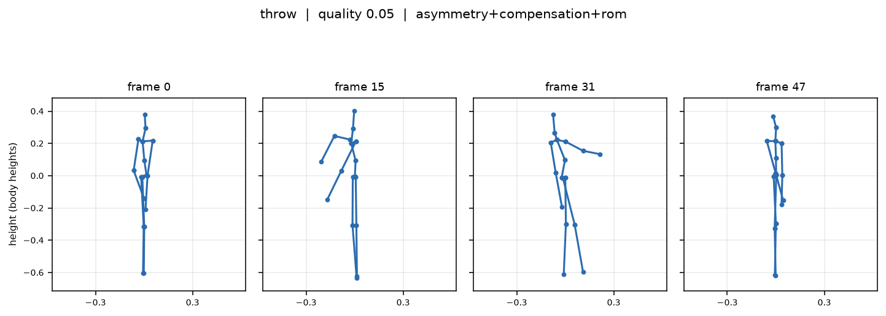
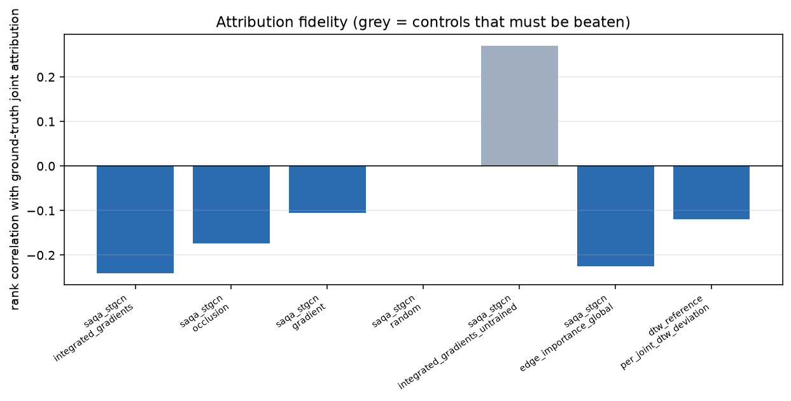
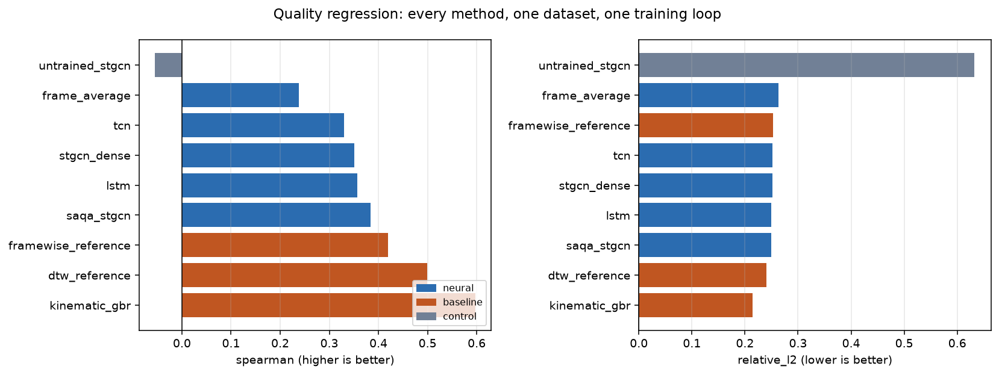
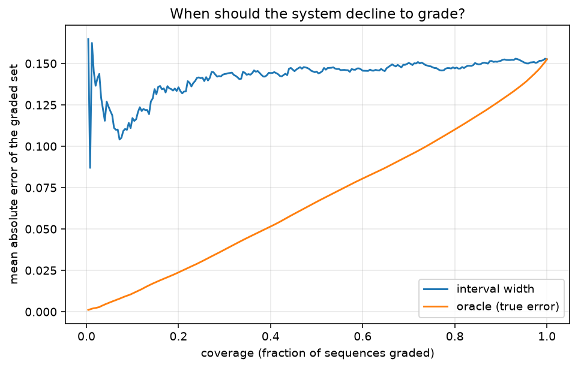
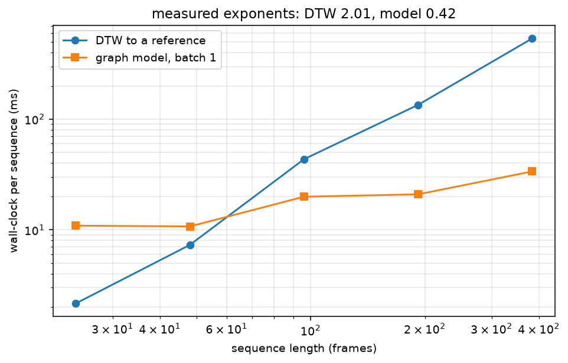
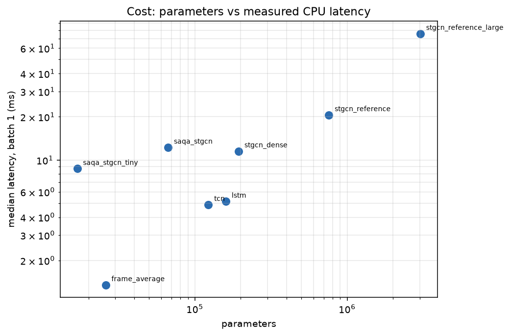

# What Should I Change? — Skeletal Action-Quality Attribution

<!-- links:begin -->
**[Live results and figures](https://action-quality-attribution-arslan.surge.sh)** &nbsp;·&nbsp; **[Source](https://github.com/arslan-ahm/skeletal-action-quality-attribution)** &nbsp;·&nbsp; [All seven projects](https://seven-ai-projects-arslan.surge.sh)
<!-- links:end -->

> **Reference-free, calibrated action-quality regression with per-joint,
> per-phase attribution that is *validated against exact ground truth* — and
> fails that validation.**

A learner is told their squat scored 0.83. Against what? And what should they do
differently? A similarity score answers neither question, and to produce one at
all you need a reference execution of the same movement — which, for free-form
assessment, does not exist.

This repository predicts quality directly from a single sequence, with a
calibrated interval, and localises the loss to a `(joint, phase)`. Then it does
the thing attribution work usually skips: **it measures whether that map is
correct.**

---

## Summary for the reader in a hurry

|  | Finding | Status |
|---|---|---|
| ❌ | **An untrained network localises the true cause better than a trained one** (+0.27 vs −0.24 rank correlation; 47.5% vs 0.0% top-1) | **Negative — the main result** |
| ✅ | The **validation harness detects that failure**. Without its two controls, a top-*k* precision of 0.51 would have read as success | **Contribution** |
| ⚡ | **45.3× fewer parameters, 51.5× fewer MACs, 6.18× lower latency** than the reference-scale ST-GCN | **Measured** |
| ⚠️ | The DTW baseline it replaces is **1.47× faster at 48 frames** — the speed win is asymptotic, not universal | **Honest cost** |
| ❌ | **No method ranking survives** the three-seed study. This retracts the paired-bootstrap verdict reported alongside it | **Retracted** |
| ❌ | The ordinal head **does not deliver monotonicity** — 16.2% of ordered severity pairs scored the wrong way round | **Negative** |

**Contents** ·
[Problem](#1-the-problem-a-scalar-cannot-say-where) ·
[Checkable truth](#2-what-makes-the-attribution-claim-checkable) ·
[The sanity-check failure](#3-the-central-result-the-attributions-fail-their-own-sanity-check) ·
[Score regression](#4-score-regression-and-the-seed-study) ·
[Efficiency](#5-efficiency-and-a-crossover-that-runs-the-wrong-way) ·
[Reproduce](#7-reproduce) ·
[Citation](#9-citation)

---

## 1. The problem: a scalar cannot say *where*

The approach this replaces takes two videos, extracts 3D pose, aligns them with
dynamic time warping, and reports one similarity number. Three structural
problems, none fixed by a better distance function:

| problem | why it is structural |
|---|---|
| **Not actionable** | "0.83" does not tell a learner to push their knees out. A coach says *where* and *when*; a scalar cannot carry a `(joint, phase)` claim. |
| **Not calibrated** | Without a reference population, 0.83 is not a probability, a rank, or a distance in any interpretable space. |
| **Needs a reference performance** | For free-form assessment — an athlete's own technique, a patient's gait — there is none, so the method cannot be *applied* at all. |

<p align="center">
  
  <br><sub><b>Figure 1.</b> Frames from the procedural generator. Five action classes over a fixed 17-joint tree, grounded so the lower ankle rests on the floor.</sub>
</p>

---

## 2. What makes the attribution claim checkable

```
generator                        →  quality label  =  f(applied severities)      exact
run forward kinematics twice     →  joint truth    =  what each defect moved     exact
  (with and without each defect)    frame truth
```

The hard part is not producing an attribution map — any gradient method does
that. The hard part is knowing whether the map is **right**, because no
human-annotated action-quality dataset records which joint caused which point of
the deduction. That is why the data is generated: a degradation is a named,
severity-parameterised edit to a joint-angle trajectory, so **the cause is known
exactly**.

Attribution is scored against that truth **and against two controls a
convincing-looking heat map has to beat**:

1. a **uniform-random** attribution;
2. the *same method applied to an untrained model* — the parameter-randomisation
   sanity check of Adebayo et al. (2018).

<details>
<summary><b>The degradation taxonomy, and three decisions that guard against a silent benchmark defect</b></summary>

<br>

| kind | mechanism | cost `w_k` |
|---|---|---|
| `rom` | reduced range of motion at a DOF **and its mirror** (bilateral) | 0.40 |
| `asymmetry` | the same reduction on one side only | 0.35 |
| `tempo` | monotone reparameterisation of time (rushing / dragging) | 0.25 |
| `jerk` | band-limited high-frequency oscillation added to a DOF | 0.20 |
| `instability` | low-frequency sway added to the pelvis trajectory | 0.30 |
| `compensation` | a DOF loses range **and a second gains range to hide it** | 0.45 |

- **`rom` is bilateral, `asymmetry` unilateral.** Were both one-sided they would
  be mechanically identical while carrying different label costs — the target
  would be unlearnable, and nothing would surface the error. A generator can
  define an impossible task without raising an exception, which is the most
  dangerous failure mode a synthetic benchmark has. Asserted by
  `test_rom_is_bilateral_and_asymmetry_is_not`.
- **`compensation` is the most expensive**, matching coaching reality: a shallow
  squat hidden behind lumbar flexion is worse than a shallow squat. It is also
  the hardest attribution case — the *observable* change is at the compensating
  joint while the *cause* is at the restricted one.
- **Degradations shrink a DOF toward its temporal mean**, not toward zero.
  Shrinking to zero would change the posture's offset as well as its range.

The resulting truth is **concentrated, not diffuse**: top-3 joint mass averages
0.49 against 0.18 for a uniform vector over 17 joints. A method that ranks joints
well is rewarded; the metric is not degenerate.

</details>

---

## 3. The central result: the attributions fail their own sanity check

`n = 129` degraded test sequences (clean sequences have no cause to attribute and
are **excluded** rather than scored as perfect); `n = 120` for rank correlation.

| attribution | top-*k* precision | IoU | rank corr. | **top-1 hit** | overlap |
|---|---|---|---|---|---|
| `integrated_gradients` | 0.5095 | 0.4038 | **−0.2405** | **0.000** | 0.4752 |
| `occlusion` | 0.5282 | 0.4256 | **−0.1738** | **0.000** | 0.3143 |
| `gradient` | 0.5275 | 0.4181 | −0.1060 | 0.0583 | 0.5028 |
| `edge_importance_global` (model's own attention) | 0.5267 | 0.4098 | **−0.2249** | **0.000** | 0.5973 |
| `random` *(control)* | 0.5551 | 0.4442 | +0.0010 | 0.0333 | 0.5455 |
| **`ig_untrained` *(control)*** | **0.6902** | **0.5639** | **+0.2699** | **0.4750** | **0.6781** |

<p align="center">
  
  <br><sub><b>Figure 2.</b> The sanity-check failure, plotted. The untrained network scores <b>above</b> the trained one at finding the joint that was actually degraded.</sub>
</p>

> [!WARNING]
> **An untrained network explains this task's ground truth better than a trained
> one.** That is precisely the failure mode Adebayo et al. (2018) described — a
> saliency map reflecting input geometry rather than anything the model learned.
> Here we can go further than they could, because the ground truth exists: the
> untrained map is not merely *similar*, it is **more accurate**.

It holds across architectures — not just the graph model:

| architecture | rank corr. trained | rank corr. untrained | top-1 trained | top-1 untrained |
|---|---|---|---|---|
| `saqa_stgcn` | −0.2405 | **+0.2699** | 0.000 | **0.4750** |
| `stgcn_dense` | −0.1764 | **+0.1456** | 0.000 | **0.1167** |
| `lstm` | −0.0276 | **+0.2441** | 0.1750 | **0.2000** |
| `tcn` | +0.0000 | **+0.2901** | 0.1417 | **0.2500** |
| `frame_average` *(no temporal order)* | +0.0135 | −0.0648 | 0.1917 | 0.1667 |
| `dtw_reference` (per-joint deviation) | −0.1194 | — | **0.3333** | — |

### It is not an implementation error

| check | evidence |
|---|---|
| IG satisfies its **completeness axiom** | mean abs. residual **8.7 × 10⁻⁴** (max 4.9 × 10⁻³) at 24 steps, against a score range of 0.95 |
| A **gradient-free** method agrees | occlusion performs no backward pass, shares no code path, reaches −0.1738 with top-1 = 0.000 |
| The ground truth is **not degenerate** | exact by construction, top-3 mass 0.49 vs 0.18 uniform |
| The random control **behaves** | +0.0010 — indistinguishable from zero, the correct chance level |

### The trap the controls avoided

Had only top-*k* precision been reported — as attribution work without ground
truth effectively must — the trained model's **0.5095** would have read as a
positive result. It is **below** the random control's **0.5551**. Top-*k*
precision saturates when *k* approaches the number of affected joints, hiding the
failure completely.

> **The two controls cost one forward pass through an untrained network and one
> call to a random number generator.** They are the only reason this is visible.

---

## 4. Score regression, and the seed study

| method | family | Spearman | Kendall | rel. *L*₂ | MAE | coverage |
|---|---|---|---|---|---|---|
| `kinematic_gbr` | baseline | **0.5968** | 0.4271 | **0.2140** | **0.1289** | 0.880 |
| `dtw_reference` | baseline | 0.4996 | 0.3467 | 0.2407 | 0.1452 | 0.864 |
| `framewise_reference` | baseline | 0.4191 | 0.2950 | 0.2524 | 0.1512 | 0.868 |
| `saqa_stgcn` (ours) | neural | 0.3842 | 0.2641 | 0.2498 | 0.1526 | 0.896 |
| `lstm` | neural | 0.3569 | 0.2423 | 0.2498 | 0.1561 | 0.800 |
| `stgcn_dense` | neural | 0.3507 | 0.2380 | 0.2518 | 0.1541 | 0.860 |
| `tcn` | neural | 0.3305 | 0.2281 | 0.2521 | 0.1557 | 0.864 |
| `frame_average` | neural | 0.2381 | 0.1633 | 0.2626 | 0.1600 | 0.932 |
| `untrained_stgcn` | control | −0.0547 | −0.0358 | 0.6319 | 0.4353 | 1.000 |

A three-seed study puts the run-to-run scale of a Spearman difference at
**σ_run = 0.1205**. Verdicts are computed from |Δ| / σ_run, not chosen:

| comparison vs `dtw_reference` | Δ Spearman | ratio | verdict |
|---|---|---|---|
| `untrained_stgcn` | −0.5543 | 4.60 | ✅ **robust** |
| `frame_average` | −0.2615 | 2.17 | ✅ **survives** |
| `tcn` | −0.1691 | 1.40 | ⚠️ suggestive |
| `stgcn_dense` | −0.1489 | 1.24 | ⚠️ suggestive |
| `lstm` | −0.1427 | 1.18 | ⚠️ suggestive |
| **`saqa_stgcn` (ours)** | −0.1154 | 0.96 | ❌ *inside noise* |
| `kinematic_gbr` | +0.0973 | 0.81 | ❌ *inside noise* |

<p align="center">
  
  
  <br><sub><b>Figure 3.</b> Left: regression quality by method — read against σ_run = 0.1205 before ranking anything. Right: risk–coverage. Error-detection AUROC is 0.5347 against a noise scale of 0.0516, so <b>no method here supports selective prediction</b>.</sub>
</p>

**Two things survive, and both are comparisons against a deliberately weakened
arm:** temporal modelling beats frame-averaging (2.17×), and training beats
random weights (4.60×). **Nothing else does** — including this repository's own
model against the DTW formulation it was built to replace. We do not claim the
graph model is better at scoring, and we do not concede that it is worse.

<details>
<summary><b>What else was measured, and came out negative</b></summary>

<br>

- **Monotonicity is not delivered.** On severity ladders — which fix subject,
  action, defect target and all internal randomness, varying only severity with
  the sensor model off — the graph model's score *increases* when a defect is made
  worse on **16.2%** of ordered pairs (35% of ladders contain a violation; max
  increase 0.0092). `tcn` is best at 11.5%, `stgcn_dense` worst at 29.0%.
  `docs/METHOD.md` predicted the ordinal head would not guarantee this.
- **Rank consistency is exact.** Zero crossed quantile intervals and zero ordinal
  rank inconsistencies across all methods. Arithmetic, not statistics.
- **Coverage is close to nominal**: 89.6% against 90%.
- **Intervals do not support abstention** — error-detection AUROC 0.5347 against
  σ_run 0.0516.

</details>

---

## 5. Efficiency, and a crossover that runs the wrong way

Ten warm-up iterations, thirty timed repeats, median and IQR, 2 torch threads at
48 frames. Ratios are against `stgcn_reference_large`.

| architecture | params (M) | MMACs | latency bs1 | IQR | MMAC/ms | params ↓ | latency ↓ |
|---|---|---|---|---|---|---|---|
| `saqa_stgcn_tiny` | 0.017 | 4.94 | 8.70 ms | 2.03 | 0.57 | 179.0× | 8.69× |
| **`saqa_stgcn` (default)** | **0.067** | **16.92** | **12.23 ms** | 2.70 | 1.38 | **45.3×** | **6.18×** |
| `stgcn_dense` | 0.194 | 43.82 | 11.53 ms | 1.46 | 3.80 | 15.6× | 6.56× |
| `stgcn_reference` | 0.759 | 167.54 | 20.57 ms | 2.19 | 8.15 | 3.99× | 3.68× |
| `stgcn_reference_large` | 3.024 | 872.19 | 75.62 ms | 5.39 | 11.53 | 1× | 1× |
| `tcn` | 0.123 | 5.83 | 4.89 ms | 0.30 | 1.19 | 24.6× | 15.47× |
| `lstm` | 0.160 | 7.55 | 5.15 ms | 2.13 | 1.47 | 18.9× | 14.69× |

> [!NOTE]
> **Read the IQR column.** This machine was shared. An earlier run of this same
> table had `stgcn_dense` (43.8 MMACs) measuring *slower* than `stgcn_reference`
> (167.5 MMACs) — arithmetically impossible, and pure contention.

Two things the MAC column gets wrong:

- **A 51.5× MAC reduction buys 6.2× latency.** The graph model retires 1.38
  MMAC/ms; the reference-scale ST-GCN retires 11.53 — **8.3× more**. Wide dense
  convolutions vectorise; narrow depthwise ones are memory-bandwidth bound.
- **The separable temporal stage saves parameters and MACs but no time at all.**
  Against `stgcn_dense` — the identical architecture with dense temporal
  convolutions — `saqa_stgcn` has 2.9× fewer parameters, 2.59× fewer MACs, and is
  **6% slower** (12.23 vs 11.53 ms).

### The cost comparison that actually separates the two approaches

DTW pays *O(T²)* twice; the graph model is *O(T)*. Exponents are **fitted on the
log–log slope**, not asserted: **DTW 2.013**, model **0.422**.

| frames | DTW total | model | speed-up |
|---|---|---|---|
| 24 | 2.16 ms | 10.89 ms | 0.20× |
| **48** | **7.30 ms** | **10.72 ms** | **0.68×** |
| 96 | 43.48 ms | 19.91 ms | 2.18× |
| 192 | 134.82 ms | 20.92 ms | 6.45× |
| 384 | 537.42 ms | 33.70 ms | **15.95×** |

<p align="center">
  
  
  <br><sub><b>Figure 4.</b> Left: the crossover falls between 48 and 96 frames — <b>on the wrong side of this repository's own operating point</b>. Right: size and speed against the reference-scale ST-GCN.</sub>
</p>

> **Anyone quoting a speed-up over DTW without attaching a sequence length is
> quoting the wrong number.** At 48 frames — the length of every accuracy
> experiment here — DTW is still 1.47× faster.

---

## 6. Limitations

1. **The data are synthetic.** This is what makes the central experiment
   possible, and it is the principal threat to external validity. Whether
   trained-model attributions also fail on human data with human-annotated causes
   is not established here and cannot be.
2. **Scale.** Four CPU cores, no GPU, 2 threads. The largest models *trained*
   have 0.194 M parameters; the reference-scale architectures are characterised
   for cost only.
3. **Three seeds**, so the standard deviations are themselves uncertain. They are
   used to *reject* claims — the direction in which a noisy variance estimate is
   conservative — never to accept any.
4. **Agreement with a human judge is not measured** and cannot be: the quality
   label is synthetic.
5. **Four attribution methods, not a survey.** SHAP, LIME and Grad-CAM variants
   were not tested.

---

## 7. Reproduce

```bash
git clone https://github.com/arslan-ahm/skeletal-action-quality-attribution.git
cd skeletal-action-quality-attribution
uv sync

uv run pytest -q                                       # 482 tests
uv run python scripts/benchmark_efficiency.py          # §5
uv run python scripts/score_attribution.py             # §3 — the central result
uv run python scripts/compare_methods.py               # §4
uv run python scripts/render_docs.py --check           # fails if any doc number drifted
```

CPU only, no dataset download — the motion generator is procedural and every
sample is a pure function of one integer.

---

## 8. Repository layout

```
src/saqa/     library: generator, kinematics, models, attribution, metrics
scripts/      benchmark · compare_methods · score_attribution · seed_study
configs/      YAML experiment definitions
notebooks/    01 data+truth · 02 train · 03 attribution · 04 uncertainty
              05 Colab full-scale
results/      tables/ (CSV, authoritative) · figures/ · runs/
docs/         METHOD.md · RESULTS.md · REPRODUCIBILITY.md
tests/        482 tests
```

---

## 9. Citation

```bibtex
@software{ahmad2026saqa,
  author = {Ahmad, Arslan},
  title  = {What Should I Change? Skeletal Action-Quality Attribution with
            Ground-Truth Validation},
  year   = {2026},
  url    = {https://github.com/arslan-ahm/skeletal-action-quality-attribution}
}
```

**Method reference.** The parameter-randomisation control that produces this
repository's central result is from Adebayo et al., *Sanity Checks for Saliency
Maps*, NeurIPS 2018 ([arXiv:1810.03292](https://arxiv.org/abs/1810.03292)).
Integrated gradients is Sundararajan et al., ICML 2017
([arXiv:1703.01365](https://arxiv.org/abs/1703.01365)).

**Reference work.** The task framing was taken from the MediaPipe pose-comparison
project by **Habiba Sajid**
([3d-Pose-and-action-comparison](https://github.com/HabibaSajid321/3d-Pose-and-action-comparison)),
which computes joint-angle differences between two videos. That repository
carries no licence and no associated publication, so no citation is requested and
none of its code is reused; it is credited here as the origin of the problem
statement.

---

## License

MIT — see [LICENSE](LICENSE).
